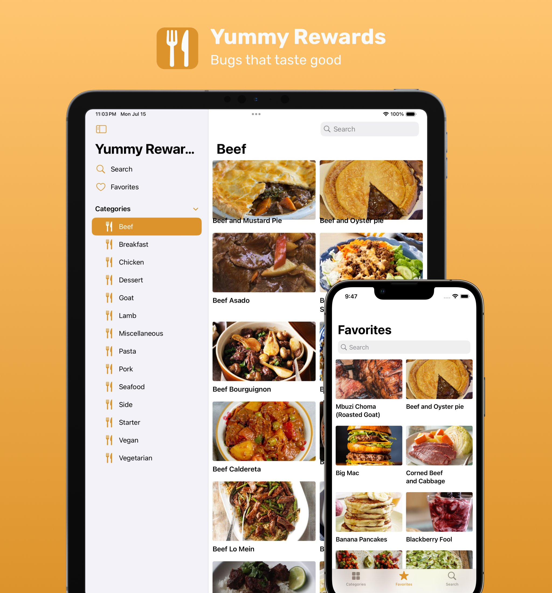

## Descipriton
Yummy Rewards is an dedicated application for Fetch Rewards QA team to asses potential canidates.

## Known Bugs
The project contains a list of the following known bugs.

1. A category image may be a person playing baseball.
2. 10% chance that a category image may never load
3. A meal cells text has a 33% chance of overlapping the image
4. Marking a meal as a favorite via the context menu will not work
5. A meal tag can have the inccorect background color
6. Rich links (youtube) videos are not tappable
7. The "Favorites" icon is a heart in sometimes and a star others
8. Cateogires may be incorrectly sorted
9. When the main view loads, 3 seconds later a false, poorly worded alert will show.
10. When the 3rd checkmark on the meal details screen is tapped, the app will crash
11. The empty placeholder view on the meals view controller is a document
12. Sometimes "Favorites" is spelled incorrectly
13. The search bar view controller has small and italicized fonts
14. The last search term is saved and shown, but is not used
15. The search placeholder view is shown when you have results, and hidden when you do not.
16. There is a 10% chance the a category cell may push to favorites instead of the cateogry details.
17. There is a 10% chance the meals view controller may push to the incorrect details screen
18. There is a 10% chance the meals view controller may push not push anywhere
19. If the meals view controller does push, and it's on the faovirtes screen, there will be a three second delay
20. If the meals view controller is on the favoirites screen and is tapped multiple times, multiple screens can be pushed at once after a delay.
